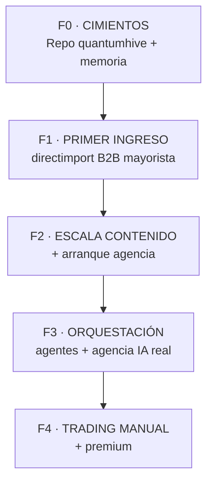

# 🐝 QuantumHive — Mapa Maestro de Implementación (v2.0)

> [!abstract] Qué es este documento
> La **columna vertebral** del proyecto. La guía que leen Claude Code y Claude (estrategia) antes de construir. Nace del análisis de **143 videos** procesados con Gemini, depurados (~113 recursos reales) y reordenados en un plan cronológico real. Es un **orden de batalla**, no un catálogo de cosas lindas.

---

## 🗺️ Cómo usar esta bóveda

| Nota | Para qué | Cuándo |
|------|----------|--------|
| [[01 - Reglas de Oro y Lectura Critica]] | Reglas inamovibles + principio de biblioteca + lectura crítica de Gemini | **Antes de tocar nada** |
| [[02 - Plan Cronologico]] | Plan fase por fase con dependencias y gates | **Al arrancar cada fase** |
| [[03 - Stack Definitivo por Categoria]] | Opciones por categoría (se elige al aplicar) | Al elegir herramienta |
| [[04 - Catalogo de Recursos]] | Los ~113 recursos con repo verificado | Dudas sobre un recurso |
| [[05 - Auditoria Critica - Sesion Gemini]] | Verificación de los recursos #87+ | Referencia sesión 2 |

> [!tip] Regla de oro de la bóveda
> El catálogo es la **biblioteca completa** (nada se descarta). Pero **tener ≠ usar**: una herramienta entra en juego cuando su fase lo pide y se elige al aplicar.

---

## 🎯 Los 3 frentes (un solo motor)

1. **@directimport420 — B2B mayorista high-ticket** (capital→provincia). Caja rápida → **F1, primero**.
2. **Agencia de servicios IA** (automatizaciones, webs, apps, carta QR PyME) + canal de contenido → **F2-F3**.
3. **Trading manual** (@traderboss420). Lo opera Sergio a mano; soporte de visión → **F4. Sin bots** (Atlas descartado).

---

## ⏱️ Las 5 fases (orden de construcción del motor)

| Fase | Objetivo | Gate |
|------|----------|------|
| **F0** | Entorno limpio con reglas y memoria | Repo `quantumhive` con primer commit + CLAUDE.md + n8n en Render |
| **F1** | Primer DM → venta → comisión (mayorista B2B) | **Primera comisión cobrada** |
| **F2** | Contenido diario + leads + canal agencia | Máquina de contenido y captación sola |
| **F3** | Agentes coordinados + agencia IA servicio | Orquestador verificado + AGI con memoria + primer cliente agencia |
| **F4** | Trading manual con soporte + premium | Trading integrado al mismo motor |

---

## 📍 Estado real hoy (1 Jun 2026)

- ✅ AGI Telegram en HuggingFace (Claude → Groq → Gemini)
- ✅ @directimport420 con identidad visual — **foco inmediato (B2B mayorista)**
- ✅ @traderboss420 (519 seguidores) — manual, sin automatizar
- ✅ Arsenal de ~113 recursos verificados (sesiones 1 y 2)
- 🔴 Repo **`quantumhive`** → a crear (F0). Viejo a `legacy/`.
- 🔴 Render + n8n → a desplegar (F0)
- 🔴 `agente_cerebro.py` → integrar en F3 (memoria persistente)
- ❌ Bot de trading (Atlas) → **descartado**. Trading = manual.

---

## ⚠️ Lo que NO hacemos (detalle en [[01 - Reglas de Oro y Lectura Critica]])

- ❌ Instalar todo junto — una herramienta entra cuando la anterior está estable.
- ❌ `--dangerously-skip-permissions`.
- ❌ Confiar en los puntajes de Gemini (infla casi todo).
- ❌ Integrar sin verificar la **URL exacta** del repo.
- ❌ Reemplazar decisiones por vibe — las alternativas conviven, se elige al aplicar.
- ❌ Modelos pesados en local (Mac 2015) → APIs cloud.
- ❌ Construir frentes avanzados sin el ingreso base.

---
**Siguiente paso real:** abrir [[02 - Plan Cronologico]] y arrancar por **F0 · paso 0.1**.
