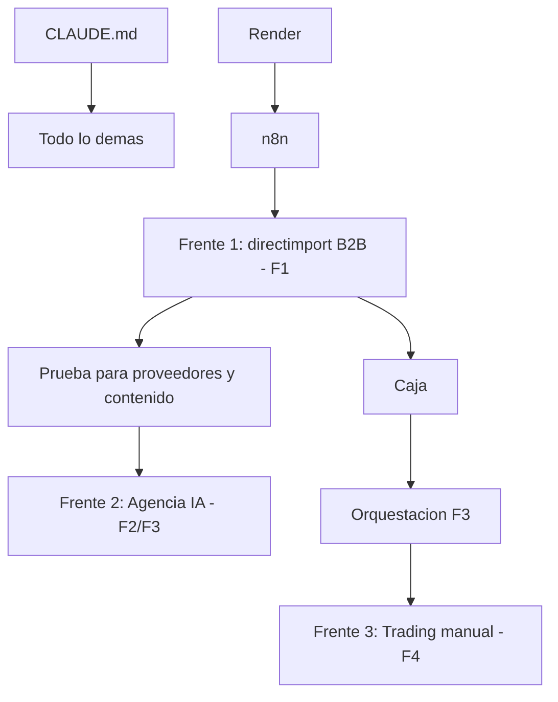

# 02 · Plan Cronológico — La Columna Vertebral (v3.0)

⬅️ Volver al [[00 - Mapa Maestro]] · Reglas: [[01 - Reglas de Oro y Lectura Critica]] · Stack: [[03 - Stack Definitivo por Categoria]]

> [!abstract] Cómo se lee
> Las **fases (F0–F4) son el orden de construcción del MOTOR.** Los **3 frentes de negocio** corren sobre ese motor y se prenden en secuencia, no en paralelo. No se saltea de fase. El catálogo es biblioteca: la herramienta concreta se elige **al ejecutar cada paso**.

> [!info] Los 3 frentes (mismo motor, distinto orden)
> 1. **@directimport420 — B2B mayorista high-ticket** (capital→provincia). **Primero**: es la caja rápida → arranca en F1.
> 2. **Agencia de servicios IA** (automatizaciones, webs, apps, carta QR para PyMEs) + canal de contenido. Crece con el motor → F2-F3.
> 3. **Trading manual** (@traderboss420). Lo opera Sergio a mano; soporte de visión → F4. **No hay bots** (Atlas descartado).

---

## 🧱 FASE 0 — CIMIENTOS · `#fase/F0` · Día 1-2

> [!goal] Objetivo
> Entorno limpio donde Claude Code tenga reglas y memoria. Repo **`quantumhive`** (sin `-v2`).

**Prerrequisitos:** ninguno.

| # | Paso | Herramienta | Por qué |
|---|------|-------------|---------|
| 0.1 | Render → desplegar n8n | n8n en Render | Reemplaza Oracle. Lo necesita F1. |
| 0.2 | Crear repo **`quantumhive`** en GitHub | GitHub | Repo limpio. Viejo en `legacy/`. |
| 0.3 | **Crear `CLAUDE.md`** (incluye regla `/rewind` y "tener≠usar") | CLAUDE.md | Primer archivo siempre. |
| 0.4 | GitHub MCP | GitHub MCP | Commits automáticos. |
| 0.5 | Context7 | Context7 | Mata alucinaciones. |
| 0.6 | Superpowers (+ find-skills) | Superpowers | TDD + planificación. |
| 0.7 | Claude-Mem | Claude-Mem | Memoria entre sesiones. |
| 0.8 | AWS Bedrock ($200, DolarApp) | Bedrock | FreeEngine capa 2. |
| 0.9 | DeepSeek vía NVIDIA (⚠️ verificar modelo) + OpenRouter + Bytez | FreeEngine | Capa 3 + puentes a modelos baratos. |
| 0.10 | Aider con DeepSeek | Aider | Ejecutor económico. |
| 0.11 | **Auditoría del repo viejo + consolidar visión** (Claude Code lee, no toca) → genera `05b - Visión Completa` | Claude Code | Rescatar `indicadores.py`, `skills_trading.py`, `agi_telegram.py`. Y unificar nombre `quantumhive` en toda la bóveda. |

> [!success] GATE F0
> ✅ Repo `quantumhive` con **primer commit**. ✅ Claude Code arranca con CLAUDE.md + memoria. ✅ n8n responde en Render. **Si no, no se pasa a F1.**

---

## 💵 FASE 1 — PRIMER INGRESO (@directimport420 B2B mayorista) · `#fase/F1` · Semana 1

> [!goal] Objetivo
> **Primer DM → primera venta → primera comisión.** Modelo: **mayorista B2B**, capital→provincia, productos high-ticket. Foco en márgenes/lotes, NO consumidor final. (La primera comisión también es la **prueba** que destraba a proveedores escépticos.)

**Prerrequisitos:** Gate F0.

| # | Paso | Herramienta | Notas |
|---|------|-------------|-------|
| 1.1 | Flujo n8n: orden por Telegram → post (copy + imagen) → aprobación → publica | n8n (+ **n8n MCP** para que Claude lo arme) | Flujo central. |
| 1.2 | Imagen de producto pro | SAM 3 + Real-ESRGAN + generador | Recorte + nitidez. |
| 1.3 | Landing de venta por lote | Page Pilot AI / **claude-webkit** | Web en ~60s. |
| 1.4 | Captación: outreach a revendedores | Manual + **Playwright / Chrome DevTools MCP / Agent-Browser** + **Humanizalo** | Empezar manual; escalar. Elegir navegador al aplicar. |
| 1.5 | Cierre: embudo WhatsApp | **whatsapp-agentkit** + (OpenWA / YCloud / **Evolution API**) | El vendedor que no duerme. Gateway a elegir. |
| 1.6 | Cobro: link de pago B2B | **PagoKit** (Mercado Pago) | Probar un cobro de prueba. |
| 1.7 | Scouting: qué pedir y a qué margen | Teemdrop + TikTok scouting | + proveedores mayoristas con catálogo (NO Combox/minorista). |

> [!success] GATE F1
> ✅ **Primera comisión cobrada.** Plata real, no "post lindo". Hasta entonces no se invierte en F2.

---

## 📈 FASE 2 — ESCALA DE CONTENIDO + ARRANQUE AGENCIA · `#fase/F2` · Semana 2-3

> [!goal] Objetivo
> Con caja entrando: automatizar contenido diario, flujo de leads, y **arrancar el canal de la agencia** documentando los builds reales (no reciclar videos ajenos).

**Prerrequisitos:** Gate F1.

| # | Paso | Herramienta | Notas |
|---|------|-------------|-------|
| 2.1 | Video para Reels/anuncios (elegir 1 + backup) | Gemini Omni/Veo / Hunyuan / **editor-pro-max** / Odysser | Un motor, no quince. |
| 2.2 | Avatar + voz de marca | **LivePortrait + VibeVoice** + claude-banana | Avatar persistente de la agencia. |
| 2.3 | Outreach masivo + clonar diseños competencia | Playwright + Firecrawl | |
| 2.4 | DMs de Instagram | ManyChat | Embudo IG→WhatsApp. |
| 2.5 | Blindaje de código | Security Review (nativo) | Calidad antes de volumen. |
| 2.6 | Procesar videos restantes del arsenal | Gemini 1.5 Pro + NotebookLM | UCI. |
| 2.7 | **Canal agencia:** contenido original mostrando builds (carta QR, app barbería) | editor-pro-max + avatar | Embudo de la agencia IA. |

> [!success] GATE F2
> ✅ Contenido diario programado + leads constantes sin outreach 100% manual.

---

## 🤖 FASE 3 — ORQUESTACIÓN, AGENTES Y AGENCIA IA · `#fase/F3` · Con caja estable

> [!goal] Objetivo
> Pasar a agentes coordinados, AGI con memoria persistente, y **la agencia IA como servicio real** (carta QR PyME, agente de reservas, apps).

**Prerrequisitos:** Gate F2 + caja para créditos.

| # | Paso | Herramienta | Notas |
|---|------|-------------|-------|
| 3.1 | **Elegir UN orquestador** (verificar antes) | OpenClaw / Hermes Agent / Antigravity | Estrellas/commits/issues. No a ciegas. |
| 3.2 | Mapear los agentes contra plantillas | Agency-Agents + ECC + the-architect | |
| 3.3 | Decisiones grandes multi-IA | LLM Council | |
| 3.4 | Ruteo a modelos $0 | OpenRouter + Bytez + Kimi | |
| 3.5 | **AGI Telegram: integrar `agente_cerebro.py`** → memoria persistente | rescate + Gemini Embedding | Resuelve el pendiente crítico. |
| 3.6 | Producto agencia: carta QR / app reservas / app revendedores | 21st.dev + claude-webkit + PagoKit + Rork | Tesis PyME. |
| 3.7 | Optimización de tokens (repo ya grande) | Graphify | |

> [!success] GATE F3
> ✅ Orquestador elegido **y verificado** estable. ✅ AGI con memoria persistente. ✅ Primer cliente de agencia.

---

## 🏛️ FASE 4 — TRADING MANUAL + PREMIUM · `#fase/F4` · Futuro

> [!goal] Objetivo
> Soporte al trading **manual** de Sergio (no bots) y productos premium, con la misma infraestructura.

**Prerrequisitos:** Gate F3.

| # | Paso | Herramienta | Notas |
|---|------|-------------|-------|
| 4.1 | Asistente de visión de pantalla para operar | Mark-XXXIX | Detecta patrones en Bookmap/Delta/MT5 mientras Sergio opera. |
| 4.2 | Soporte de datos/research (opcional, bajo) | Databento / Maya | Sin bots. |
| 4.3 | Web premium `quantumhive.io` | 21st.dev + WebGL Magic | Estética Nivel 2. |
| 4.4 | Productos premium | — | Según tracción. |

> [!success] GATE F4
> ✅ Trading manual con soporte integrado al mismo motor.

---

## 🔗 Dependencias (resumen)

---
**Stack →** [[03 - Stack Definitivo por Categoria]] · **Catálogo →** [[04 - Catalogo de Recursos]]
