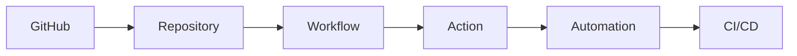

# GitHub Actions - Deep Dive

> BrainFeeder v4 | 2026-07-11 | [[2026-07-11 - GitHub Actions - Summary]]

---
## Concept Map

> [Full Wikipedia Article](https://en.wikipedia.org/wiki/GitHub)

---
## Active Recall

- [ ] Explain the core idea in 2 sentences
- [ ] What problem does it solve?
- [ ] Name 3 key concepts
- [ ] How does this connect to what I already know?
- [ ] What would I search to learn more?

## Research Queue - Add These Next

- [ ] [[Continuous Integration (CI)]]
- [ ] [[Continuous Delivery (CD)]]
- [ ] [[YAML syntax]]

---
## Navigation
- [[Automation MOC]]
- [[2026-07-11 - GitHub Actions - Summary]]

## My Research Notes

> Add insights here...
