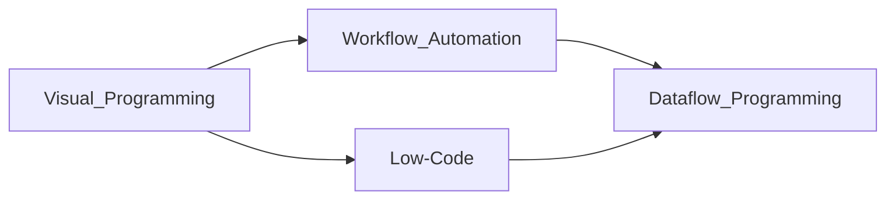

# n8n - Deep Dive

> BrainFeeder v4 | 2026-07-11 | [[2026-07-11 - n8n - Summary]]

---
## Concept Map

## Complete Breakdown

### Overview

n8n (pronounced "n-eight-n", a contraction of "nodemation") is a workflow automation platform and the Berlin company, n8n GmbH, that develops it. Founded by Jan Oberhauser and first released publicly in 2019, n8n lets users build automations by wiring together applications, services and AI models in a visual, node-based editor, with the option to use custom JavaScript or Python. It runs as a self-hosted application or as a managed cloud service, and has been described in coverage as a source-available alternative to hosted tools such as Zapier and Make.

### Overview

As of December 2025, the n8n company's platform was being reported effective at linking and integrating data and functions "between more than 350 established applications", with latitude to also engage custom services and apps used within client organizations. Between its October 2019 launch and April 2021, the community of members—developers and “citizen developers”—using the platform had grown to approximately 16,000.

### History

n8n GmbH was founded in 2019 by Jan Oberhauser, in Berlin, and launched its first version of its eponymous platform in October of that year. In March 2020, n8n raised $1.5 million in seed funding co-led by Sequoia Capital and firstminute capital. n8n raised a further $12 million in a Series A round, in April 2021, led by Felicis Ventures, with participation from Sequoia, firstminute, and Harpoon. In March 2025, n8n closed a €55 million (≈$60 million) Series B round led by Highland Europe, joined by HV Capital and prior investors. In October 2025, n8n raised $180 million in a Series C round, bringing the company’s valuation to $2.5 billion; the round was led by Accel with participation from: 

> *(truncated)*

### Platform

n8n is built on Node.js and TypeScript and presents automations as a visual editor in which users connect "nodes", each representing an application, service or operation, into a workflow. Where the visual nodes fall short, users can write JavaScript or Python in a code node. Coverage in 2025 put the number of integrations in the several hundreds, with cited figures ranging from about 400 to more than 1,000.

### Technology

The n8n platform is implemented using Node.js. Further reading McFeetors, Jason  & Pant, Tanay (February 2022). Rapid Product Development with n8n (PDF). Birmingham, England: n8n (imprint)-Packt Publishing Ltd. ISBN 978-1-80181-736-3. Retrieved 21 November 2025.{{cite book}}:  CS1 maint: multiple names: authors list (link)

> [Full Wikipedia Article](https://en.wikipedia.org/wiki/N8n)

---
## Active Recall

- [ ] Explain the core idea in 2 sentences
- [ ] What problem does it solve?
- [ ] Name 3 key concepts
- [ ] How does this connect to what I already know?
- [ ] What would I search to learn more?

## Research Queue - Add These Next

- [ ] [[Low-code development platforms]]
- [ ] [[Dataflow programming]]
- [ ] [[Workflow automation tools]]

---
## Navigation
- [[Automation MOC]]
- [[2026-07-11 - n8n - Summary]]

## My Research Notes

> Add insights here...
