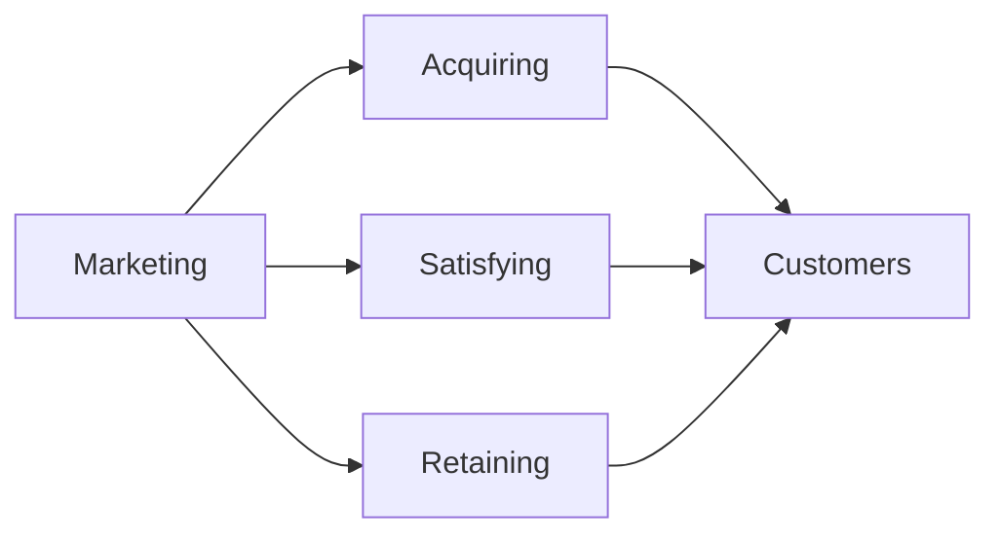

# Marketing - Deep Dive

> BrainFeeder v4 | 2026-07-11 | [[2026-07-11 - Marketing - Summary]]

---
## Concept Map

## Complete Breakdown

### Overview

Marketing is the act of acquiring, satisfying and retaining customers. It is one of the primary components of business management and commerce. Marketing is usually conducted by the seller, typically a retailer or manufacturer. Products can be marketed to other businesses (B2B) or directly to consumers (B2C). Sometimes tasks are contracted to dedicated marketing firms, like a media, market research, or advertising agency. Sometimes, a trade association or government agency (such as the Agricultural Marketing Service) advertises on behalf of an entire industry or locality, often a specific type of food (e.g. Got Milk?), food from a specific area, or a city or region as a tourism destination. 

> *(truncated)*

### Definition

Marketing is currently defined by the American Marketing Association (AMA) as "the activity, set of institutions, and processes for creating, communicating, delivering, and exchanging offerings that have value for customers, clients, partners, and society at large". However, the definition of marketing has evolved over the years. The AMA reviews this definition and its definition for "marketing research" every three years. The interests of "society at large" were added into the definition in 2008. The development of the definition may be seen by comparing the 2008 definition with the AMA's 1935 version: "Marketing is the performance of business activities that direct the flow of goods, and s

> *(truncated)*

### Concept

The "marketing concept" proposes that to complete its organizational objectives, an organization should anticipate the needs and wants of potential consumers and satisfy them more effectively than its competitors. This concept originated from Adam Smith's book The Wealth of Nations but would not become widely used until nearly 200 years later. Marketing and Marketing Concepts are directly related. Given the centrality of customer needs, and wants in marketing, a rich understanding of these concepts is essential: Needs: Something necessary for people to live a healthy, stable and safe life. When needs remain unfulfilled, there is a clear adverse outcome: a dysfunction or death. Needs can be o

> *(truncated)*

### Venues

Business services The four major categories of B2B product purchasers are: Producers - use products sold by B2B marketing to make their own goods (e.g.: Mattel buying plastics to make toys) Resellers - buy B2B products to sell through retail or wholesale establishments (e.g.: Walmart buying vacuums to sell in stores) Governments - buy B2B products for use in government projects (e.g.: purchasing weather monitoring equipment for a wastewater treatment plant) Institutions - use B2B products to continue operation (e.g.: schools buying printers for office use) B2C marketing Business-to-consumer marketing, or B2C marketing, refers to the tactics and strategies in which a company promotes its prod

> *(truncated)*

### The 4Ps

The 4Ps refers to four broad categories of marketing decisions, namely: product, price, promotion, and place. The origins of the 4 Ps can be traced to the late 1940s. The first known mention has been attributed to a Professor of Marketing at Harvard University, James Culliton. The 4 Ps, in its modern form, was first proposed in 1960 by E. Jerome McCarthy; who presented them within a managerial approach that covered analysis, consumer behavior, market research, market segmentation, and planning. Phillip Kotler, popularised this approach and helped spread the 4 Ps model. McCarthy's 4 Ps have been widely adopted by both marketing academics and practitioners.

### Product

The product aspects of marketing deal with the specifications of the actual goods or services, and how it relates to the end-user's needs and wants. The product element consists of product design, new product innovation, branding, packaging, and labeling. The scope of a product generally includes supporting elements such as warranties, guarantees, and support. Branding, a key aspect of the product management, refers to the various methods of communicating a brand identity for the product, brand, or company.

> [Full Wikipedia Article](https://en.wikipedia.org/wiki/Marketing)

---
## Active Recall

- [ ] Explain the core idea in 2 sentences
- [ ] What problem does it solve?
- [ ] Name 3 key concepts
- [ ] How does this connect to what I already know?
- [ ] What would I search to learn more?

## Research Queue - Add These Next

- [ ] [[Customer Relationship Management (CRM)]]
- [ ] [[Marketing Strategy]]
- [ ] [[Consumer Behavior]]

---
## Navigation
- [[Business MOC]]
- [[2026-07-11 - Marketing - Summary]]

## My Research Notes

> Add insights here...
