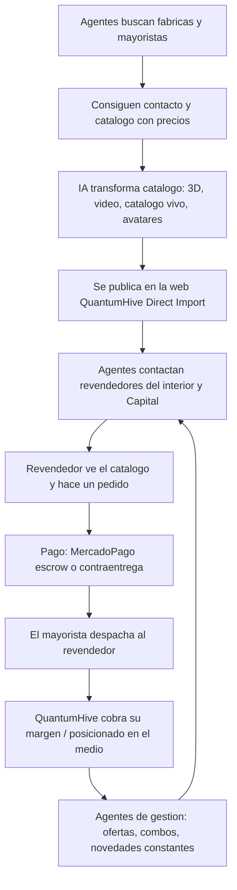

# 🏗️ Frente 1 — B2B Mayorista Inteligente · Contexto Madre

> [!abstract] Qué es este documento
> El **contexto madre del Frente 1**. Recoge, ordena y formaliza el modelo de negocio tal como lo definió Sergio (CEO). Es la fuente de verdad para Claude (estrategia), Claude Code (ejecución) y cualquier IA que trabaje en este frente. Acá no hay opiniones ni objeciones: está el modelo, explicado para que no quede lugar a dudas.

---

## 1. Resumen ejecutivo

QuantumHive Direct Import (`@directimport420`) es una **capa tecnológica que se posiciona en el medio entre los mayoristas/fábricas y los revendedores del interior del país.** No compite contra los revendedores: les ofrece la tecnología y la llegada que ellos no tienen, y les facilita la venta.

El negocio se apoya en un **motor de agentes de IA** que:
1. Busca y contacta de forma masiva a fábricas y mayoristas (incluidos los que no publican catálogo).
2. Consigue sus catálogos con precios.
3. Transforma esos catálogos con IA (imágenes 3D, videos, presentación profesional, catálogo vivo, avatares).
4. Los publica en una plataforma web propia bajo la marca QuantumHive Direct Import.
5. Busca y contacta revendedores y negocios ya establecidos (con agentes humanizados, no spam frío).
6. Mantiene a esos clientes activos con ofertas, combos y novedades de forma constante.

El resultado es un ecosistema que **absorbe las estructuras de venta existentes metiéndolas adentro**, porque ninguna de ellas tiene la tecnología que QuantumHive construye.

---

## 2. El marco — la visión que da origen al proyecto

Este negocio no nace de la necesidad de "sobrevivir" ni de cambiar tiempo por dinero. Nace de una decisión de vida del CEO: **buscar libertad y abundancia, no atar la vida entera a una sola habilidad para subsistir.**

Sergio tiene la capacidad de generar dinero con muchísimas habilidades y oficios, pero su objetivo no es explotar una sola de ellas para vivir, sino **construir una infraestructura que genere dinero en automático** —agentes trabajando solos, multiplicación de capital vía trading— para poder llevar a cabo sus proyectos sin límite de tiempo ni de dinero.

La era de la IA y los agentes es la **brecha real** que faltaba para materializar esta visión. La tecnología que antes no existía hoy lo permite. QuantumHive es el vehículo para plasmarla.

> [!note] Marco, no debate
> Este apartado es el porqué del proyecto. Define el criterio de las decisiones: se prioriza construir una máquina escalable y automática por sobre obtener una ganancia rápida y manual. No es algo a discutir; es el norte.

---

## 3. Quién lo construye — experiencia real de mercado

El modelo no es teórico: está fundado en la experiencia directa del CEO dentro de este mercado.

- Estudió **abogacía** (notas de 9 y 10); dejó antes de recibirse por decisión propia.
- Tuvo **negocios propios**: cerrajería, mueblería, peluquería. Conoce de primera mano todos los rubros de la construcción, la venta y el comercio.
- **Vendió muebles en el interior**, dependiendo del sistema de viajantes (ver sección 4).
- **Vendió zapatillas puerta a puerta** en el interior (Olavarría) con un catálogo de mayorista ("el libro"), cobrando al doble y financiando en cuotas, y aun así con mejor precio que los locales de la zona.
- Vive en Capital hace 6-7 años, pero **viene del interior**: conoce los dos lados del mostrador.

Esta experiencia es el **verdadero moat** del proyecto: el conocimiento granular y vivido de cómo funciona el comercio del interior, qué duele, cómo opera el viajante y qué precio aguanta cada mercado. La tecnología es la herramienta; este conocimiento es lo que ningún competidor de escritorio tiene.

---

## 4. El dolor del mercado que se ataca

El comercio del interior funciona con una estructura rígida y dolorosa para el revendedor:

- **Las fábricas de Capital no le venden al interior.** Le venden a los viajantes.
- **El local del interior nunca llega a la fábrica directa.** Sus únicas opciones son: viajar a Capital a comprar (con el mejor precio, pero con costo de tiempo y logística), o comprarle al viajante.
- **El viajante infla el precio ~100%** (no una comisión chica: el doble).
- **El viajante engancha con contraentrega:** deja la mercadería y se cobra después. Es un gancho casi imposible de rechazar para el local.
- Pero la contraentrega del viajante es una **trampa / ayuda disfrazada:** termina fundiendo al local, que pasa a venderle prácticamente a él, entregando cheques. **El viajante es odiado** por los revendedores.

**Resultado:** el revendedor del interior está mal atendido. Paga el doble, tiene poca variedad, no accede a productos nacionales ni importados de distintas calidades, y queda atado a un proveedor que lo exprime. Ese es el dolor que QuantumHive resuelve.

---

## 5. La propuesta de valor y el posicionamiento

> [!important] El posicionamiento es la clave del modelo
> QuantumHive **NO compite contra el revendedor.** Se posiciona **en el medio**, entre los mayoristas/fábricas y los revendedores, y le ofrece al revendedor la tecnología y la llegada que no tiene.

La plataforma web es una **herramienta que el revendedor usa para vender mejor**, no un competidor que le saca clientes. Le da:

- Acceso a **múltiples fábricas y mayoristas** (nacionales e importadores) en un solo lugar.
- **Variedad, calidades y precios** que por su cuenta nunca conseguiría.
- Catálogos con **presentación profesional premium** (3D, video, catálogo vivo) que el revendedor no sabe ni puede producir.
- Una alternativa **mejor que el viajante**: sin la trampa de la contraentrega que funde, con la llegada y la tecnología de QuantumHive.

La diferencia frente a los competidores actuales (los que hoy mueven volumen con redes sociales y estructura propia): **ninguno tiene la tecnología que QuantumHive construye.** Por eso la estrategia no es pelearles de frente, sino **absorber sus estructuras metiéndolas dentro del ecosistema.**

---

## 6. El modelo de negocio en detalle

### 6.1. La lógica central: arbitraje + tecnología

QuantumHive consigue acceso a producto barato (fábricas/mayoristas que no llegan al interior), le agrega **presentación premium con IA** y lo ofrece al mercado del interior que carece tanto del acceso como de la habilidad de marketing.

El margen se justifica por dos razones:
1. **Se le ofrece el producto directamente** al revendedor, sin que tenga que salir a buscarlo.
2. **La publicidad premium armada con IA** entra por los ojos y posiciona el producto.

### 6.2. Ejemplo concreto (caso campera)

- Hay vendedores (ej. en Instagram) que venden ropa muy barata: una campera a **$20.000**.
- QuantumHive la ofrece a **$30.000**, con publicidad, videos y catálogo mejorados con IA, dirigida al público del interior.
- Esos vendedores baratos solo publicitan a revendedores locales cercanos; **no saben manejar la IA ni tienen llegada al interior.** QuantumHive sí.
- Un local de ropa (ej. La Plata) recibe el mensaje del agente (un gancho), pide 10 camperas.
- Cuestan $20.000, se ofrecieron a $30.000 → margen por unidad.
- Se despacha (ej. motomandado o logística del mayorista) y se cierra la venta.
- **Con agentes automatizados, esto se hace de forma masiva y multi-rubro.**

### 6.3. Multi-rubro y multi-fábrica

El modelo no es de un solo producto: es **multi-rubro y multi-fábrica.** QuantumHive ofrece productos de distintas fábricas bajo su propia marca, como si fuera la fábrica/mayorista. Incluye:
- **Fábricas nacionales.**
- **Importadores** (productos internacionales).
- Distintas **calidades, precios y categorías**.

### 6.4. Retención de clientes

Una vez captado un revendedor, la automatización permite estar **constantemente encima del cliente**: ofreciéndole productos nuevos, ofertas y combos. El cliente no tiene la llegada ni el acceso de QuantumHive (no contacta él mismo a todas las fábricas ni accede a las distintas calidades y precios), lo que sostiene la relación y evita que se saltee la plataforma.

---

## 7. El motor agéntico — cómo funciona

El corazón del frente es una **estructura multi-agente** que automatiza el circuito completo. Los agentes están **humanizados** (no son mensajes fríos robotizados).

| Grupo de agentes | Función |
|---|---|
| **Agentes de sourcing (proveedores)** | Buscan de forma masiva fábricas, mayoristas y grupos mayoristas. Consiguen teléfonos, webs y contactos. Solicitan catálogos (incluso a fábricas que no los publican). |
| **Procesamiento de catálogos (IA)** | Desglosan el catálogo con precios, transforman las imágenes a 3D, arman videos de producto, generan catálogo vivo y avatares que promocionan. |
| **Plataforma / web** | Une proveedores y productos en una web profesional bajo la marca QuantumHive Direct Import. Es la herramienta que el revendedor usa. |
| **Agentes de captación (revendedores)** | Buscan y contactan revendedores y negocios establecidos del interior y Capital. Les ofrecen el catálogo y el gancho. |
| **Agentes de gestión de clientes** | Mantienen al cliente activo: ofertas, combos, novedades, seguimiento constante. |

> [!info] El rol de la IA según Sergio
> Lo que ningún competidor tiene es esta tecnología. La IA es la llegada masiva a los compradores y la que produce la presentación premium. La estructura agéntica es lo que permite operar a **escala masiva**, que es el enfoque del negocio (no la venta de a una).

---

## 8. El flujo operativo (de punta a punta)

---

## 9. Pago y logística

**Pago (sin necesidad de inventar nada — usar lo que ya existe):**
- **MercadoPago con dinero congelado (escrow):** el cliente paga, el mayorista ve el pago y despacha, el dinero queda congelado hasta que el cliente recibe, y recién ahí se libera. Cubre la confianza en ambos sentidos.
- **Contraentrega:** también disponible como opción.

**Logística (ya armada por los proveedores):**
- El **mayorista/fábrica despacha directo** al revendedor (modelo de dropshipping mayorista).
- QuantumHive **conecta las piezas** (proveedor ↔ producto ↔ revendedor), no monta la logística desde cero.

> El principio operativo: la logística y el sistema de pago **ya existen** en las plataformas y proveedores. El trabajo de QuantumHive es **conectar uno con otro** gracias al sistema de agentes que busca proveedores y revendedores de forma masiva.

---

## 10. Relación con el resto del ecosistema

Este frente corre sobre el **mismo motor** que potencia los otros frentes de QuantumHive. La misma infraestructura de agentes, generación de contenido con IA y plataformas reutiliza para:

- **Frente 2 — Agencia de servicios IA para PyMEs** (cartas QR con agente de IA, apps con prueba de imagen para peluquerías, webs, automatizaciones). Estrategia de entrada: **demo gratis por un mes** → cuota mensual baja. *(Detalle en su propio contexto madre.)*
- **Frente 3 — Trading** (la mayor fortaleza profesional del CEO; multiplica el capital que el ecosistema genera).

El Frente 1 es la **caja de arranque** que da empuje al resto.

---

## 11. Variables a definir al ejecutar

Por decisión explícita del CEO, varias definiciones **no se fijan de antemano** sino que se resuelven a medida que el motor opera y los agentes traen datos reales:

| Variable | Definición |
|---|---|
| **Rubro de arranque** | No se elige un rubro fijo primero. Se arma la estructura y **los agentes buscan proveedores mayoristas**; el rubro surge de lo que se consiga. |
| **Margen** | Según los precios que encuentren los agentes (el ejemplo de referencia es ~+50% / +100%, como en los casos vividos). |
| **Quién paga a quién** | Se define según el negocio concreto (QuantumHive posicionado en el medio entre mayorista y revendedor). |
| **Envío** | Lo más probable: **despacha el mayorista directo**, según lo que se acuerde con cada proveedor que consigan los agentes. |

---

## 12. Estado y siguiente paso

- **Estado:** modelo definido y plasmado. Motor base de QuantumHive (repo, n8n, Claude Code con FreeEngine, memoria) en construcción — ver bóveda principal.
- **Siguiente paso concreto:** **armar la estructura de agentes que busca proveedores mayoristas.** Ese es el punto de arranque del Frente 1.

---

> [!quote] Frase que resume el frente
> "No compito contra los revendedores: les doy la tecnología que no tienen y me posiciono en el medio entre los mayoristas y ellos. Después absorbo todas esas estructuras metiéndolas dentro de mi ecosistema."

---
*Documento vivo — Contexto Madre del Frente 1. Creado el 3 de junio de 2026 a partir de la definición del modelo por Sergio Palomba (CEO).*
