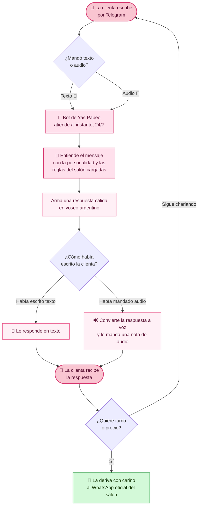
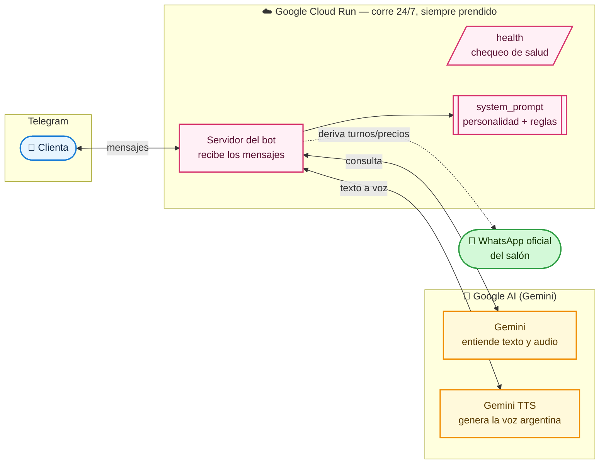

# Yas Papeo — Cómo funciona el bot 🌸

Diagrama de arquitectura para presentación. Dos vistas:
1. **El recorrido de la clienta** (lo que le importa a Jazz)
2. **Cómo está hecho por dentro** (la parte técnica)

> Para presentarlo lindo en la reunión, abrí `arquitectura.html` en el navegador.

---

## 1. El recorrido de la clienta

---

## 2. Las reglas de oro del bot (lo que NUNCA hace)

- 🤫 **Nunca dice que es un bot.** Atiende como "quien atiende el chat del salón".
- 💲 **Nunca da precios.** Cada cabello necesita diagnóstico → deriva a las chicas.
- 📅 **Nunca agenda turnos.** Los turnos se coordinan por el WhatsApp oficial.
- 🧠 **Se acuerda de la conversación** de cada clienta mientras chatean.
- 🛟 **Si se corta la conexión, responde en personaje** ("se me trabó un segundito, ¿me lo repetís?") — la clienta nunca ve un error feo.
- 🚫 **No inventa.** Si no sabe algo, pide una foto y deriva a Yas o Cami.

---

## 3. Cómo está hecho por dentro (la parte técnica)

**En una frase:** la clienta escribe (o manda audio) por Telegram, un servicio que vive prendido 24/7 en Google entiende el mensaje con la inteligencia de Gemini —siguiendo la personalidad y las reglas del salón—, y le contesta al instante en texto o en voz, derivando al WhatsApp cuando quiere reservar.
