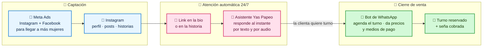
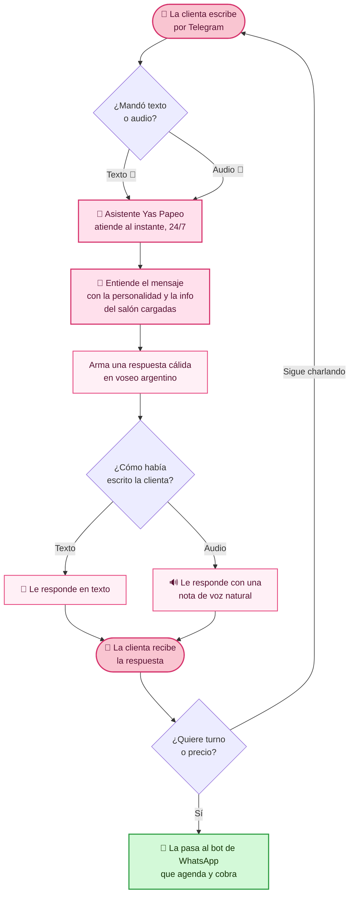
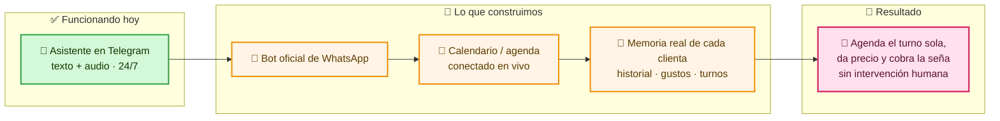
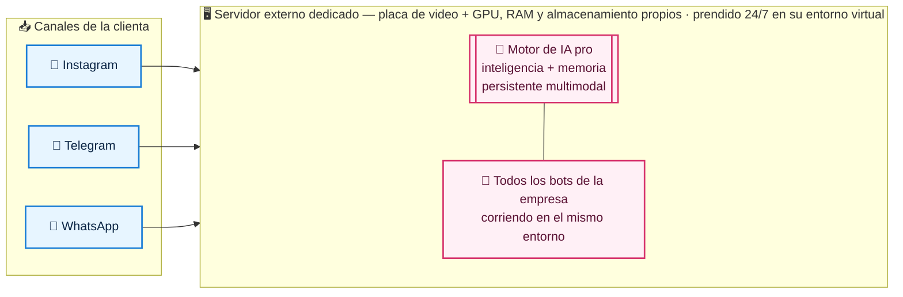

# Yas Papeo — Sistema de venta y atención automática 🌸

Mapa de negocio para presentación. Cuatro vistas:
1. **El embudo de venta** — de Instagram al turno cobrado
2. **Qué hace el asistente hoy** — lo que ya funciona
3. **Cómo lo llevamos al 100% automático** — roadmap + qué hace falta activar
4. **La infraestructura empresarial** — la base que escala

> Para presentarlo lindo en la reunión, abrí `arquitectura.html` en el navegador.

---

## 1. El embudo de venta (el corazón)

Todo arranca en **Instagram**: la clienta ve un post o una historia, toca el link y cae directo en el asistente, que la atiende sola y la lleva hasta el turno reservado y pago.

---

## 2. Qué hace el asistente hoy (ya funciona)

**Cómo atiende (las reglas del asistente):**

- 🤫 **Nunca dice que es un bot.** Atiende como una asesora más del salón.
- 🎤 **Entiende y responde por texto y por audio**, en voseo argentino cálido.
- ⚡ **Responde al instante, 24/7, los 365 días.** Ninguna clienta queda sin respuesta.
- 🧠 **Se acuerda de la conversación** de cada clienta mientras chatean.
- 📲 **Cuando quiere turno o precio, la pasa al bot de WhatsApp** que agenda y cobra.
- 🚫 **No inventa.** Trabaja siempre con la info real del salón.

---

## 3. Cómo lo llevamos al 100% automático (roadmap)

El asistente que ya atiende es el primer ladrillo. El siguiente salto es que **agende el turno solo y cobre la seña**, sin que nadie del salón tenga que tocar el teléfono.

### Ya está listo ✅
- Asistente que atiende por Telegram
- Texto y audio, voz argentina natural
- Personalidad del salón cargada
- Responde 24/7 al instante

### Para activar la automatización total ▢
- **WhatsApp oficial** (número verificado + proveedor)
- **Meta Ads** (Business Manager + presupuesto de pauta)
- **Calendario / agenda** del salón conectado en vivo
- **Pasarela de cobro** para la seña (medios de pago)
- **Lista de precios y servicios** para cargar al bot

---

## 4. La infraestructura empresarial (la base que escala)

No es "un bot suelto": es la base sobre la que se monta **toda la operación digital del salón** (y mañana, varios bots trabajando juntos como un enjambre).

**En una frase:** la clienta llega desde Instagram, un **motor de IA pro con memoria persistente multimodal** la atiende al instante por texto o voz, y la lleva hasta el turno agendado y la seña cobrada por WhatsApp — todo corriendo en un **servidor externo dedicado con GPU propia**, listo para escalar a una **agencia de bots automatizados (swarm)** que opere todo el negocio sola.
