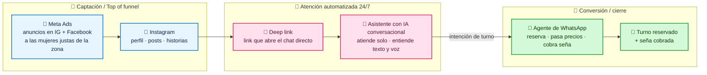
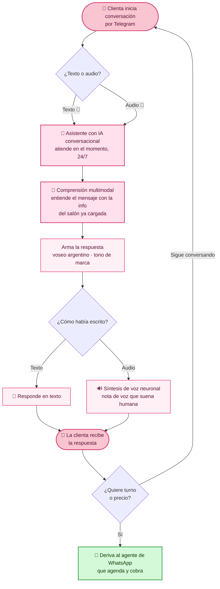
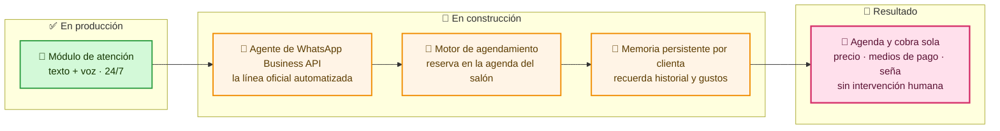
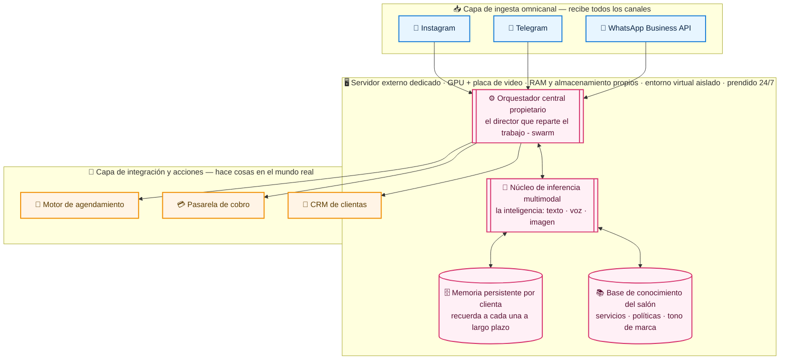
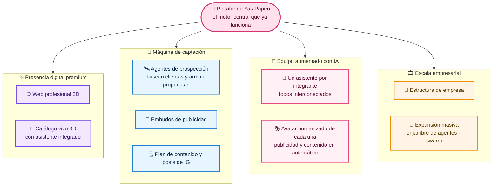

# Yas Papeo · Belleza Capilar — Plataforma de IA conversacional 🌸

**@yaspapeobeauty** · Arquitectura · Propuesta QuantumHive

Arquitectura para presentación. Cinco vistas:
1. **Embudo de conversión** — de Instagram al turno cobrado
2. **Capacidades en producción** — el módulo ya operativo
3. **Roadmap a la automatización integral** — próxima fase + requerimientos
4. **Arquitectura e infraestructura** — la plataforma que escala (con glosario "en criollo")
5. **Visión a futuro** — el ecosistema completo de la empresa

> Para presentarlo en la reunión, abrí `arquitectura.html` en el navegador.
> Las aclaraciones *(entre paréntesis e itálica)* explican cada término técnico en palabras simples.

---

## 1. Embudo de conversión (el corazón)

Toda la demanda se origina en **Instagram** y se canaliza, vía link, hacia el asistente con IA *(el que atiende solo)*, que la recibe en el momento y la lleva por el camino hasta el turno reservado y la seña cobrada.

---

## 2. Capacidades en producción (operativo)

Módulo ya desplegado y funcionando *(ya está hecho y prendido)*. Se puede probar en vivo desde el celular ahora mismo.

**Características del módulo de atención:**

- 🤫 **Atención conversacional indistinguible de una asesora humana** *(nunca se nota que es un sistema).*
- 🎤 **Procesamiento multimodal** *(entiende y responde en texto y en voz, con voz que suena humana).*
- ⚡ **Disponibilidad 24/7/365** *(siempre disponible, sin horarios ni esperas).*
- 🧠 **Memoria contextual** *(sigue el hilo de la charla con cada clienta).*
- 📲 **Derivación inteligente** *(cuando hay que cerrar, pasa sola al WhatsApp que agenda y cobra).*
- 🚫 **Respuestas ancladas a la base de conocimiento real del salón** *(solo dice info verdadera, no inventa).*

---

## 3. Roadmap a la automatización integral (próxima fase)

El módulo de atención ya operativo es la primera capa. La siguiente fase suma **memoria, agenda y cobro autónomos** *(el sistema reserva el turno y cobra la seña solo, sin que nadie del salón toque el teléfono)*.

### Ya desplegado ✅
- Módulo de atención conversacional *(atiende solo por chat)*
- Texto + voz neuronal *(escribe y manda audios naturales)*
- Personalidad de marca y base de conocimiento *(habla como el salón, con su info)*
- Disponibilidad 24/7 en tiempo real

### Requerido para automatización integral ▢
- **WhatsApp Business API** *(la línea oficial de WhatsApp habilitada para automatizar)*
- **Meta Ads** *(cuenta de empresa de Meta + plata para los anuncios)*
- **Integración con la agenda** *(conectar el calendario del salón)*
- **Pasarela de pagos** *(para cobrar la seña online)*
- **Catálogo de servicios y tarifario** *(cargar precios y tratamientos)*

---

## 4. Arquitectura e infraestructura (la plataforma que escala)

No es un asistente suelto: es una **plataforma de orquestación multi-agente** *(varios asistentes coordinados como un equipo, con un director)* sobre la que se monta toda la operación digital del negocio — y, a futuro, un enjambre de agentes especializados trabajando en conjunto.

### 🔎 Qué significa cada parte (en criollo)
- **Orquestación multi-agente** — varios asistentes trabajando coordinados como un equipo, dirigidos por un "director".
- **Núcleo de inferencia multimodal** — la inteligencia que entiende y responde texto, voz e imágenes.
- **Memoria persistente por clienta** — recuerda a cada clienta a largo plazo: qué se hizo, qué le gusta, cuándo vino.
- **Base de conocimiento** — toda la info real del salón cargada (servicios, estilo, reglas).
- **Capa de ingesta omnicanal** — un solo cerebro que recibe los mensajes de todos los canales (IG, Telegram, WhatsApp).
- **Servidor dedicado con GPU** — una máquina industrial potente, prendida siempre, exclusiva para esto.
- **Entorno virtual aislado · alta disponibilidad** — su propio espacio seguro, que funciona 24/7 sin caerse.
- **Enjambre (swarm) de agentes** — muchos asistentes especializados que se van sumando a medida que el negocio crece.

---

## 5. Visión a futuro — el ecosistema completo

Sobre esta misma base se construye **todo el ecosistema digital de la empresa**: presencia premium, una máquina de captación que trabaja sola, el equipo potenciado con IA y la estructura lista para escalar.

- **🌐 Web profesional 3D** — una página premium con efectos 3D que impacta apenas entrás.
- **🧴 Catálogo vivo 3D con asistente integrado** — los tratamientos en 3D que se ven y giran, con el asistente respondiendo ahí mismo.
- **🛰️ Agentes de prospección** — asistentes que salen a buscar clientas nuevas y les arman la propuesta solos.
- **📣 Embudos de publicidad** — circuitos de anuncios que atraen clientas de forma constante.
- **🗓️ Plan de contenido y posts de IG** — un calendario de contenido pensado y producido para crecer en redes.
- **🤖 Un asistente por integrante, interconectado** — cada integrante del equipo con su propio asistente, todos conectados entre sí.
- **🎭 Avatar humanizado de cada una** — un avatar digital realista de cada una que hace publicidad y contenido en automático.
- **🏢 Estructura de empresa + 🚀 expansión masiva** — todo ordenado como empresa y listo para crecer en serie (el enjambre de agentes que opera el negocio).

**En una frase:** una **arquitectura de orquestación multi-agente propietaria** *(varios asistentes coordinados)*, desplegada en un **servidor externo dedicado con GPU y entorno virtual aislado** *(una máquina potente, prendida siempre, sólo para esto)*, unifica Instagram, Telegram y WhatsApp en un solo núcleo con **memoria persistente por clienta**: capta, atiende en el momento por texto y voz, agenda y cobra sola, y queda lista para escalar a un **ecosistema completo** —web 3D, avatares, captación automática y un enjambre de agentes— que opere todo el negocio.
