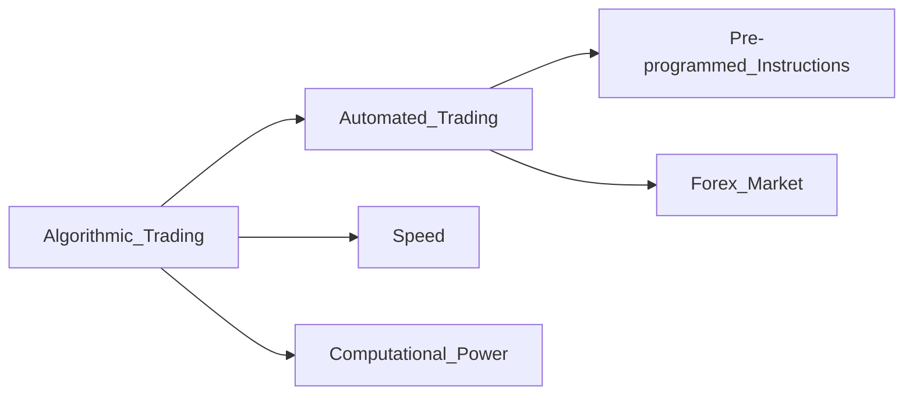

# Algorithmic Trading - Deep Dive

> BrainFeeder v4 | 2026-07-11 | [[2026-07-11 - Algorithmic Trading - Summary]]

---
## Concept Map

> [Full Wikipedia Article](https://en.wikipedia.org/wiki/Algorithmic_trading)

---
## Active Recall

- [ ] Explain the core idea in 2 sentences
- [ ] What problem does it solve?
- [ ] Name 3 key concepts
- [ ] How does this connect to what I already know?
- [ ] What would I search to learn more?

## Research Queue - Add These Next

- [ ] [[High-Frequency Trading (HFT)]]
- [ ] [[Quantitative Trading]]
- [ ] [[Machine Learning in Finance]]

---
## Navigation
- [[Trading MOC]]
- [[2026-07-11 - Algorithmic Trading - Summary]]

## My Research Notes

> Add insights here...
